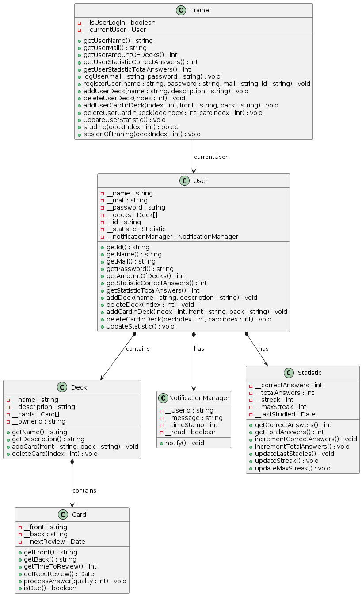

# Memory Training 

## Войно Никита 353504

## Диаграма классов 

## Функциональные требования
1. **Регистрация и вход в ситсему**
    - Регистрация с имененм, email и паролем.
    - Вход по email и паролю с перенаправлением на главную страницу.
2. **Управление колодами с картами для изучения**
    - Создание колоды с названием и описанием.
    - Редактирование и удаление колоды.
3. **Изучение карт**
    - Сессии изучения с алгоритмом интервального повторения.
    - Оценка ответов пользователя.
4. **Статистика**
    - Просмотр прогресса: правильные ответы, стрики.
    - Обновление после каждой сессии.
5. **Уведомления**
    - Напоминание о входе и занятиях.
6. **Геймификация**
    - Подсчет стриковых дней.
    - Возможные достижения.(???)

## Подробное описание с помощью Use-Case

### Use-Case 1: Регистрация пользователя
Пользователь создает новый аккаунт в приложении для доступа к его функциональности.  

- Актер: Незарегистрированный пользователь.
- Предусловия: Пользователь не имеет аккаунта в системе.

Основные события:

1. Пользователь переходит на страницу регистрации.  
2. Пользователь вводит свое имя, адрес электронной почты (email) и пароль.  
3. Система проверяет, что введенный email не зарегистрирован ранее.  
4. Система сохраняет данные пользователя в базе данных.  
5. Система активирует аккаунт пользователя.

Исключения:

- Если email занят, то вывод ошибку и просит ввести другую почту.
- При неправильном формате данных система сообщит об ошибках и запрашивает корректные данные.

Постусловия: Пользователь успешно зарегистрирован и может войти в систему.

### Use-Case 2: Вход в систему
Пользователь авторизуется в приложении, используя свои учетные данные.  

- Актер: Зарегистрированный пользователь.
- Предусловия: Пользователь имеет аккаунт в системе. 

Основные события:

1. Пользователь переходит на страницу входа.  
2. Пользователь вводит свой email и пароль в соответствующие поля.  
3. Система проверяет корректность введенных учетных данных, сравнивая их с данными в базе.  
4. Система перенаправляет пользователя на главную.

Исключения: 

-  Система выводит сообщение об ошибке "Неверный email или пароль" и предлагает повторить попытку.

Постусловия: Пользователь успешно авторизован и имеет доступ к функциональности приложения.

### Use-Case 3: Создание колоды
Пользователь создает новую колоду для хранения карточек с информацией.   

- Актер: Авторизованный пользователь.
- Предусловия: Пользователь авторизован в системе.  

Основные события:

1. Пользователь переходит на страницу управления колодами.  
2. Пользователь нажимает кнопку "Создать колоду".
3. Пользователь вводит название колоды и, при желании, описание. 
4. Система проверяет, что название колоды заполнено. 
5. Система сохраняет новую колоду в базе данных, привязав ее к аккаунту пользователя.  
6. Система перенаправляет пользователя обратно на страницу управления колодами, где отображается новая колода.

Исключения: 

-  Система выводит сообщение "Название обязательно" и не сохраняет колоду до заполнения поля.

Постусловия: Новая колода создана и доступна пользователю для добавления карточек.

### Use-Case 4: Добавление карты в колоду
Пользователь добавляет новую карточку в выбранную колоду для изучения.  

- Актер: Авторизованный пользователь.
- Предусловия: Пользователь авторизован и имеет хотя бы одну созданную колоду.  

Основные события:

1. Пользователь переходит на страницу управления колодами.
2. Пользователь выбирает существующую колоду из списка.  
3. Пользователь нажимает кнопку "Добавить карту".  
4. Пользователь вводит текст для лицевой стороны карты (вопрос) и обратной стороны (ответ).  
5. Система проверяет, что оба поля заполнены.  
6. Система сохраняет карту в базе данных, привязав ее к выбранной колоде.  
7. Система возвращает пользователя на страницу управления колодами.

Исключения: 

-  Система выводит сообщение "Заполните все поля" и не сохраняет карту до исправления.

Постусловия: Новая карточка добавлена в колоду и готова для изучения.

### Use-Case 5: Изучение колоды
Пользователь изучает карточки из выбранной колоды с использованием системы интервального повторения.  

- Актер: Авторизованный пользователь.
- Предусловия: Пользователь авторизован и имеет колоду с хотя бы одной карточкой.  

Основные события:

1. Пользователь переходит на страницу изучения в приложении.
2. Пользователь выбирает колоду из списка доступных.  
3. Система отображает лицевую сторону первой карточки, готовой к повторению.
4. Пользователь вспоминает ответ и нажимает кнопку "Показать ответ".  
5. Система показывает обратную сторону карточки. 
6. Пользователь оценивает сложность запоминания (например, "легко", "средне", "сложно").  
7. Система обновляет интервал повторения для этой карточки на основе оценки.  
8. Система переходит к следующей карточке или завершает сессию, если карточек больше нет.

Постусловия: Сессия изучения завершена, интервалы повторения карточек обновлены, статистика пользователя актуализирована.

### Use-Case 6: Просмотр статистики
Пользователь просматривает данные о своем прогрессе в изучении карточек.   

- Актер: Авторизованный пользователь.
- Предусловия: Пользователь авторизован в системе.  

Основные события:

1. Пользователь переходит на страницу статистики.
2. Система отображает общую статистику: количество правильных ответов, изученных карточек, текущий стрик и т.д.  

Постусловия: Пользователь получил информацию о своем прогрессе.

### Use-Case 7: Получение уведомлений
Система уведомляет пользователя о необходимости повторить карточки.   

- Актер: Система.
- Предусловия: Пользователь авторизован и имеет карточки, требующие повторения.   

Основные события:

1. Система периодически проверяет расписание повторений карточек пользователя.  
2. Если есть карточки, которые нужно повторить сегодня, система формирует уведомление.  
3. Система отправляет уведомление пользователю.
4. Пользователь получает уведомление и может перейти к изучению.

Постусловия: Пользователь получил уведомление и осведомлен о необходимости повторения.

### Use-Case 8: Отслеживание стриков
Система отслеживает и обновляет стрейк активности пользователя (количество дней подряд с изучением).  

- Актер: Система.
- Предусловия:Пользователь авторизован.   

Основные события:

1. Пользователь завершает сессию изучения карточек.
2. Система проверяет дату последней активности пользователя.
3. Если пользователь был активен вчера, система увеличивает текущий стрейк на 1.  
4. Если пользователь не был активен вчера, система устанавливает стрейк равным 1.  
5. Система сохраняет обновленные данные стрика в статистике пользователя.

Исключение: 
-  Если между последней активностью и текущей сессией прошло более одного дня, стрейк сбрасывается до 1.

Постусловия: Статистика стрейков обновлена и доступна для просмотра.

